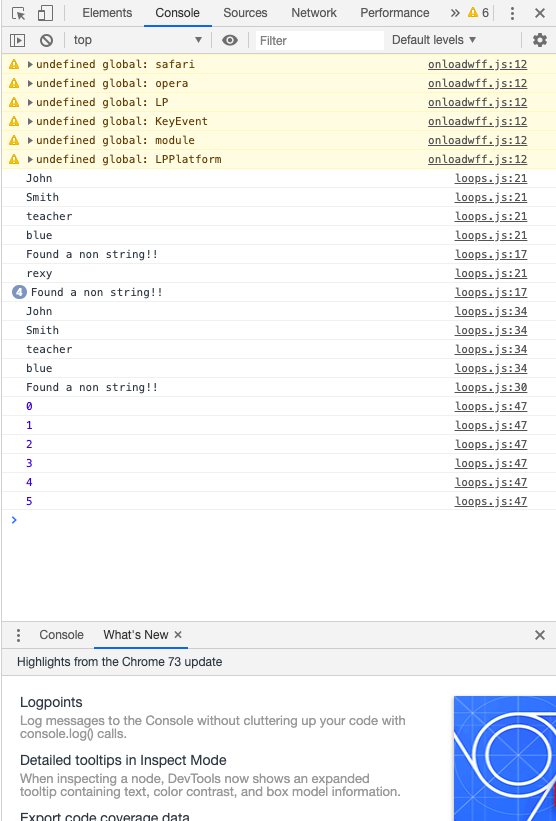

# 100 Days Of Code - Log

### Day 1: April 15, 2019 

**Today's Progress**: Started to deep deeper into the wonderful world of Javascript. Learned all about If/Else statements, Switch statements, and even Ternary Operators. Also learned, about Truthy and fasly, and equality.

**Thoughts:** First would like to say, Started doing the 100 days of coding challenge today :grin:. Big shoutout to Hugo P. for getting me started. Back to Javascript, so far i am really loving the language. I can see some similarities to Java however, I can also see the differences. I am excited to learn more.

**Link to work:** [Basic Javascript](Week-1/Day-1)

---

### Day 2: April 16, 2019 

**Today's Progress**: Finally touched on the subject of functions, arrays, and objects. Learned how functions are created in javascript as well as objects. Additionally, learned that Javascript arrays don't all have to be of the same type. This is because of type coercion.

**Thoughts:** I really enjoy programming in Javascript. I see more and more differences in the language compared to Java as I learn more and more. Like stated in the progress, I really love that the array elements don't all have to be the same data type. I also brushed my knowledge of functions and using the "this" keyword in methods.

**Link to work:** [Functions, Arrays, and Objects](Week-1/Day-2)

---
### Day 3: April 17, 2019 

**Today's Progress**: Got started on loops and iterations today. Just learned how to incorporate a for loop and a while loop into my code. (:fire: :fire: :fire:)

**Thoughts:** I am really understanding the power of Javascript. It is such a veratile OOP language and has a simple to understand syntax. I hope to continue to get better and will try to write more clean code. Lets see what Day 4 brings!!

**Link to work:** [Loops](Week-1/Day-3)

#### It may be confusing to understand, but its progress!!
   
 
 ---
 ### Day 4: April 18, 2019 

**Today's Progress**: I finished the coding challenge for the basics to Javascript. I combined all the information i learned tointo one coding task. (Objects, variables, loops, functions, operators)

**Thoughts:** I didn't realize how hard it is to et aside time to code for at least 1 hour a day. Although hard, I promised to stick through until the very end. I continue to program in Javascript and am activity thinking about becoming a web designer. Lets see where i go next.

**Link to work:** [Coding Challenge](Week-1/Day-4)

---
### Day 5: April 20, 2019 

**Today's Progress**: Learned more about ECMAScript 5. Also, was taught more about Execution Stack and how a Javascript Engine actually operates.

**Thoughts:** The more I program in Javscript, the more I relize how fun coding can really be. I hope to design a application one day that really helps solve a real world issue. Keep coding!!!

**Link to work:** [Execution Stack](Week-1/Day-5)

---

### Day 6: April 21, 2019 

**Today's Progress**: Learned about the Global Context and Execution Context. Had an in depth review of "Scope Chain" and the "this" keyword. Today was more of a overview of how Javascript works in the back-end. I have been educated more on the theoretical side of Javascript. In turn, this will make me an overall better developer :grin:.

**Thoughts:** Although, I am recently sick I still was able to push through and learn more about how Javascript works. I realize that if I want to become a better developer I can't just know how to code, but also I must know how the back-end or "compiler" of each language operates.

**Link to work:** [Variables,Scope,"this"](Week-1/Day-6)

--- 

### Day 7: April 22, 2019 

**Today's Progress**: Crash course in HTML and CSS. Learnt about how to link up the hmtl attribute identifier class and id.

**Thoughts:** This section of my learning is going to be really enjoyable. I start to actually code and build a website that is interactive. I am finally putting my Javascript basics to use.

**Link to work:** [HTML and CSS](Week-1/Day-7)

---

### Day 8: April 23, 2019 

**Today's Progress**: 

**Thoughts:** 

**Link to work:** [DOM Manipulation](Week-2/Day-8)

**Project:** [Pig-Game](https://github.com/tylerharriott/Pig-Game)

---
### Day 9: April 24, 2019 

**Today's Progress**: 

**Thoughts:** 

**Link to work:** [DOM Manipulation](Week-2/Day-9)

