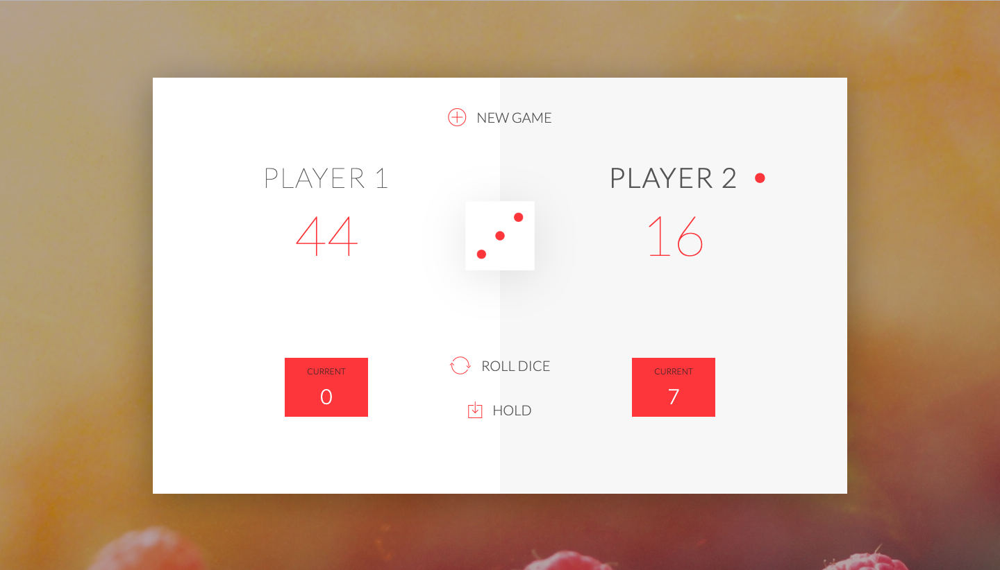

# 100 Days Of Code - Log

### Day 1: April 15, 2019 

**Today's Progress**: Started to deep deeper into the wonderful world of Javascript. Learned all about If/Else statements, Switch statements, and even Ternary Operators. Also learned, about Truthy and fasly, and equality.

**Thoughts:** First would like to say, Started doing the 100 days of coding challenge today :grin:. Big shoutout to Hugo P. for getting me started. Back to Javascript, so far i am really loving the language. I can see some similarities to Java however, I can also see the differences. I am excited to learn more.


**Link to work:** [Basic Javascript](Week-1/Day-1)

---

### Day 2: April 16, 2019 

**Today's Progress**: Finally touched on the subject of functions, arrays, and objects. Learned how functions are created in javascript as well as objects. Additionally, learned that Javascript arrays don't all have to be of the same type. This is because of type coercion.

**Thoughts:** I really enjoy programming in Javascript. I see more and more differences in the language compared to Java as I learn more and more. Like stated in the progress, I really love that the array elements don't all have to be the same data type. I also brushed my knowledge of functions and using the "this" keyword in methods.


**Link to work:** [Functions, Arrays, and Objects](Week-1/Day-2)

---
### Day 3: April 17, 2019 

**Today's Progress**: Got started on loops and iterations today. Just learned how to incorporate a for loop and a while loop into my code. (:fire: :fire: :fire:)

**Thoughts:** I am really understanding the power of Javascript. It is such a veratile OOP language and has a simple to understand syntax. I hope to continue to get better and will try to write more clean code. Lets see what Day 4 brings!!


**Link to work:** [Loops](Week-1/Day-3)

#### It may be confusing to understand, but its progress!!
   
 
 ---
 ### Day 4: April 18, 2019 

**Today's Progress**: I finished the coding challenge for the basics to Javascript. I combined all the information i learned tointo one coding task. (Objects, variables, loops, functions, operators)

**Thoughts:** I didn't realize how hard it is to et aside time to code for at least 1 hour a day. Although hard, I promised to stick through until the very end. I continue to program in Javascript and am activity thinking about becoming a web designer. Lets see where i go next.

**Link to work:** [Coding Challenge](Week-1/Day-4)

---
### Day 5: April 20, 2019 

**Today's Progress**: Learned more about ECMAScript 5. Also, was taught more about Execution Stack and how a Javascript Engine actually operates.

**Thoughts:** The more I program in Javscript, the more I relize how fun coding can really be. I hope to design a application one day that really helps solve a real world issue. Keep coding!!!


**Link to work:** [Execution Stack](Week-1/Day-5)

---

### Day 6: April 21, 2019 

**Today's Progress**: Learned about the Global Context and Execution Context. Had an in depth review of "Scope Chain" and the "this" keyword. Today was more of a overview of how Javascript works in the back-end. I have been educated more on the theoretical side of Javascript. In turn, this will make me an overall better developer :grin:.

**Thoughts:** Although, I am recently sick I still was able to push through and learn more about how Javascript works. I realize that if I want to become a better developer I can't just know how to code, but also I must know how the back-end or "compiler" of each language operates.


**Link to work:** [Variables,Scope,"this"](Week-1/Day-6)

--- 

### Day 7: April 22, 2019 

**Today's Progress**: Crash course in HTML and CSS. Learnt about how to link up the hmtl attribute identifier class and id.

**Thoughts:** This section of my learning is going to be really enjoyable. I start to actually code and build a website that is interactive. I am finally putting my Javascript basics to use.


**Link to work:** [HTML and CSS](Week-1/Day-7)

---


### Day 8: April 23, 2019 

**Today's Progress**: Starting working on a new Javascript project encompassing everything I have learned so far. I started learning more about Document Object Model(DOM) Manipuation. I am starting to see the bigger picture on how Javascript makes website more interactive for the user.

**Thoughts:** DOM Manipulation is challenging at first, but he more I practice writing the code, the more I will get better. I hope to eventually write this code so frequently that it just becomes second nature. All in all, I really like making websites now and will keep practicing my craft.


**Link to work:** [DOM Manipulation](Week-2/Day-8)

**Project:** [Pig-Game](https://github.com/tylerharriott/Pig-Game)

---
### Day 9: April 24, 2019 

**Today's Progress**: I finished up coding up the score features. Calculating the score, switching player turns, and showing the current score.

**Thoughts:** I am stepping closer and closer to finishing my first Javascript based design. I am really proud of myself and the accomplishments I have made so far in this language. I love the ease of use with Javascritpt.


**Link to work:** [DOM Manipulation](Week-2/Day-9)

**Project:** [Pig-Game](https://github.com/tylerharriott/Pig-Game)

---

### Day 10: April 25, 2019 

**Today's Progress**: I coded up the hold button. This holds the current round score into the player's final score. Also, I added the "Winner!" message for once a player gets a score equal to 100 or above.

**Thoughts:** I am learning how to not repeat myself in my coding (D.R.Y). When you repeat yourself in coding, you are more likely to write buggy code. This is a useful tip that I will carry on with me when I start developing for work.


**Link to work:** [DOM Manipulation](Week-2/Day-10)

**Project:** [Pig-Game](https://github.com/tylerharriott/Pig-Game)

---

### Day 11: April 26, 2019 

**Today's Progress**: Today I worked on adding the **New Game** feature into the website. I even simplified my code by using the "D.R.Y" to not repeat myself while coding. I learned more about functions and even how to properly use an Event Handler.

**Thoughts:** Coding is fun!! Nothing much to say today.

**Link to work:** [DOM Manipulation](Week-2/Day-11)

**Project:** [Pig-Game](https://github.com/tylerharriott/Pig-Game)

---


### Day 12: April 27, 2019 

**Today's Progress**: I finally finished my first ever Javascript project!!! I learnt so much through my experience of DOM Manipulation and being taught more about functions and scope chain.

**Thoughts:** I will be putting my project in a seperate repo. I have added also some instructions in order for a user to run the script. I am proud of yself and my accomplishments. 

**Link to work:** [DOM Manipulation](Week-2/Day-12)

**Project:** [Pig-Game](https://github.com/tylerharriott/Pig-Game)

 

---
### Day 13: April 28, 2019 

**Today's Progress**: Did some finishing touches on the Pig-Game. I did a code challenge to add some extra features to the game. One of them being a piece of code that whenever the 6-dice gets rolled twice. Then, the round score gets wiped and set back to "0".

**Thoughts:** I am actually going to take a small break to focus more on my Java data structures learning. This will most likely be for about a couple of days. Hopefully I can keep learning.

**Link to work:** [Finishing Touch](Week-2/Day-13)

**Project:** [Pig-Game](https://github.com/tylerharriott/Pig-Game)

---
### Day 14: April 29, 2019 

**Today's Progress**: Made an account on Leetcode today and started practicing my Java algorithms. I also am working on learning more about time and space complexity.

**Thoughts:** I am super tired, but I will not stop coding.

**Link to work:** [Leet Code](Week-2/Day-14)

---
### Day 15: April 30, 2019 

**Today's Progress**: Today was spent focusing my attention on Object constructors, Prototype, and the Prototype chain. I already had an idea how the setup would be based off of other OOP languages I know. I also have a deeper understanding of how inheritance works through Javascript.

**Thoughts:** I am starting to get the hang of Javascript. It will take me some time to really know the essentials but, I have confiedence in myself that I will be able to learn enough within my 100 days. 15 days done, 85 days left.

**Link to work:** [Objects, Inheritance, Prototype](Week-3/Day-15)

---

### Day 16: May 1, 2019 

**Today's Progress**: Today I started to dive into the wonderful world of objects. I started learning about another way to create an object. Yesterday, I used my time to focus on the best practice of function constructor. Now today I studied an alternative. I also was taught more about the difference between Primitives and objects.

**Thoughts:** Today was a real learning experience for me. I realized that Java is the only main language I have been using for so long. So now my brain has to re-wire itself to think differently when programming in javascript. All in all, I am trying my best to keep learning and applying the knowledge I gain.

**Link to work:** [Advance Objects | Primitives](Week-3/Day-16)

---
### Day 17: May 6, 2019 

**Today's Progress**: Decided today to learn some new information on data structures, or more specifically Linked List. I develoepd code to show how to Taverse, Insert, and Delete using a Linked List.

**Thoughts:**  I took a brief pause in my coding due to some family activites going on in the last couple of days. However, I am back and I will continue to work on Javascript as well as work on my knowledge of data structures and algorithims.

**Link to work:** [Data Structures | Linked List](Week-3/Day-17)
---
### Day 18: May 7, 2019 

**Today's Progress**: Today I went over callback functions. I learned how callback functions work, as well as implement an example. All notes are posted in the attached link.

**Thoughts:**  I realize how effective callback functions are in Javascript. It creates modular code that is easy to read and much friendlier to adding additional code to it. I hope to implemnt this logic when I start writing production enviornment code for my futre employer.

**Link to work:** [Passing Functions as Parameters](Week-3/Day-18)

---
### Day 19: May 8, 2019 

**Today's Progress**: Today's lesson was on learning about how a function can return a function.

**Thoughts:**  This is a new concept to me and i am currently trying to wrap my head around it. I review it similar to recursion but at the same time it is vastly different. I will incorporate this idea into my next project and see how it benefits the project overall.

**Link to work:** [Functions returning functions](Week-3/Day-19)

---
### Day 20: May 11, 2019 

**Today's Progress**: Explored the world of IFFE. I learned about the power of IFIFE and having an anonymous function that can hide sensitive information.

**Thoughts:**  An important part in building scalable applications is also making sure the security is at the max. Application security is a fundemntal part of designing effective code. So for me to learn more about IIFE really helped to drive home the topic of security for me.

**Link to work:** [IIFE](Week-3/Day-20)

---
### Day 21: May 13, 2019 

**Today's Progress**: Today I covered the topic of closures. Closures are a fundamental element in Javascript. They allow you to create a function that has access to elements like paramters and variables outside of that function. This is key because this is one of the benefits of using Javascript. Code becomes simplier and more easy to read and use. 

**Thoughts:** I am getting better and better with my Javascript knowledge. I have started to design my website and do all the coding myself. I plan on incorporating the code I have learnt into the website. 

**Link to work:** [Closures](Week-3/Day-21)

---
### Day 22: May 15, 2019 

**Today's Progress**: Today I worked with Bind,Call, and Apply. I just finished up the course on advance Objects and Functions. I have learnt so much just from these few videos so far. I now have a deeper understanding of how object and created, stored, and manipulated. As well as, I now know moreabout functions and the many ways a developer can use then to accomplish a certain goal.

**Thoughts:** I love the way functions areused in Javascript. My favorite lesson from this section would be the IIFE. I know how important data securityand protection is to an application. So I thought it was really cool how Javscript has a builtin way to create an anonymous function to hide variables.

**Link to work:** [Bind, Call, and Apply](Week-4/Day-22)

---
### Day 23: May 16, 2019 

**Today's Progress**: Part 7 of the coding challenge. My task was to create a basic Javascript console application to ask a user questions. Once the question is asked, I prompt the user for their answer. If they answer correctly then a ```Correct!!``` message will show. If it is wrong, then a ```Wrong!!``` message will show.

**Thoughts:** These coding challenge questions are starting to get harder and more complicated. However, I know that although I am having a hard time, I will learn way more than I every imagined.

**Link to work:** [Coding Challenge 7](Week-4/Day-23)

---
### Day 24: May 21, 2019 

**Today's Progress**: I focused my time today, educating myselfon modules. I worked on how to design them in Javascript, the benefits, and the added effectivness it has on a developer's code.

**Thoughts:** Although I am busy with work for my job, I find time at the end of my work day to study and keep progressing in my Javascript knowledge. So farit is paying off and I hopeto put my experience with Javascript to good use.

**Link to work:** [Modules](Week-4/Day-24)

**Project:** [Budget-App](https://github.com/tylerharriott/Budget-App)

---
### Day 25: May 28, 2019 

**Today's Progress**: Today I learned how to add an event listner for a key press event. Sometimesits appropriate to have a keypress listner as well as just an event listner or button listner. I also learned some new information about keypress and keycodes.  

**Thoughts:** I haven't posted in a while since I had family over and I was out of town for memoprial day. Regardless, I am back and I will continue to learn moreabout Javascript. I am looking forward to learning npm, visual studio and much more. Happy programming eveyone!!

**Link to work:** [Keypress Events](Week-4/Day-25)

**Project:** [Budget-App](https://github.com/tylerharriott/Budget-App)

---
### Day 26: July 1, 2019 

**Today's Progress**: I am continuing to learn more about how document.querySelector method works. In addition, I am learning to read input typevalue from HTML codeand better expressit in Javscritpt code.

**Thoughts:** I have stopped coding for some time. I have statrted to do more Java work at my job (UPS). I have a project I want to accomplish on schedule, so mostof my energy is spent learning Java and different automation tools from the industry. However, I have decided to go back to Javascript when I have some freetime to keep my skills sharp. Ofcourse in the end, I want to land a solid back-end developerjob.

**Link to work:** [HTML Input Type](Week-4/Day-26)

**Project:** [Budget-App](https://github.com/tylerharriott/Budget-App)
