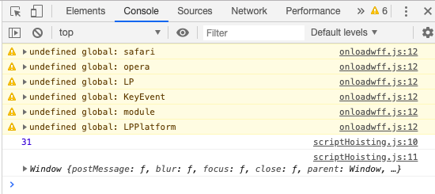
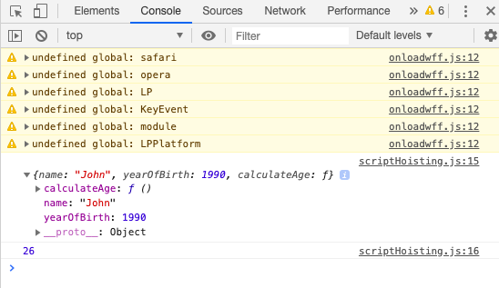

## Day 6 - Variable Object / Scope Chain / "this" keyword

### Variable Object

* You can call a function before the declaration. 
```javascript
// Lecture: Hoisting


// functions
calculateAge(1965);
function calculateAge(year) {
    console.log(2016 - year);
}

```
* However, the same **CAN'T** be done for a function expression

```javascript
retirement(1956);                 //Throws error
var retirement = function(year) {
    console.log(65 - (2016 - year));
}
```
---

### Scope Chain

* Each function creates a new scope.

* Scope - The space/environment, in which the variables it declares are accessible.
```javascript
// Lecture: Scoping

// First scoping example
var a = 'Hello!';
first();
function first() {
    var b = 'Hi!';
    second();
    function second() {
        var c = 'Hey!';
        console.log(a + b + c);
    }
}
```


* This is an example of "Lexical Scope"

* Lexical Scope is when a function that is lexically within another function gets access to the scope of the other funtion.

```javascript
// Example to show the differece between execution stack and scope chain
var a = 'Hello!';
first();
function first() {
    var b = 'Hi!';
    second();
    function second() {
        var c = 'Hey!';
        third()
    }
}
function third() {
    var d = 'John';
    //console.log(c);
    console.log(a+d);
}
```

```
Output: Third function only has access to variable "a" and "d".
```

---

### "This" keyword

* Regular function call - The "this" keyword points at the global object.
```javascript
// Lecture: The this keyword
//console.log(this);
calculateAge(1985);
function calculateAge(year) {
    console.log(2016 - year);
    console.log(this);
}
```



* Method call - The "this" keyword points to the object that is calling the method.
```javascript
var john = {
    name: 'John',
    yearOfBirth: 1990,
    calculateAge: function() {
        console.log(this);
        console.log(2016 - this.yearOfBirth);
        
        function innerFunction() {
            console.log(this);
        }
        innerFunction();
    }
}

```



* Common Javascript practice

```javascript
john.calculateAge();
var mike = {
    name: 'Mike',
    yearOfBirth: 1984
};
mike.calculateAge = john.calculateAge;
mike.calculateAge();


```
